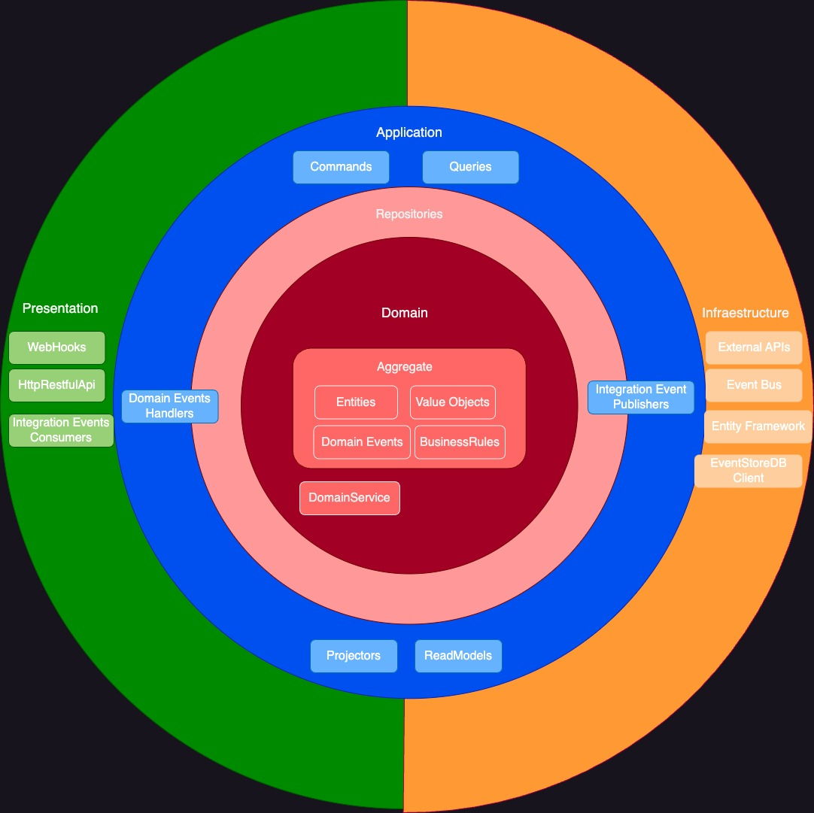
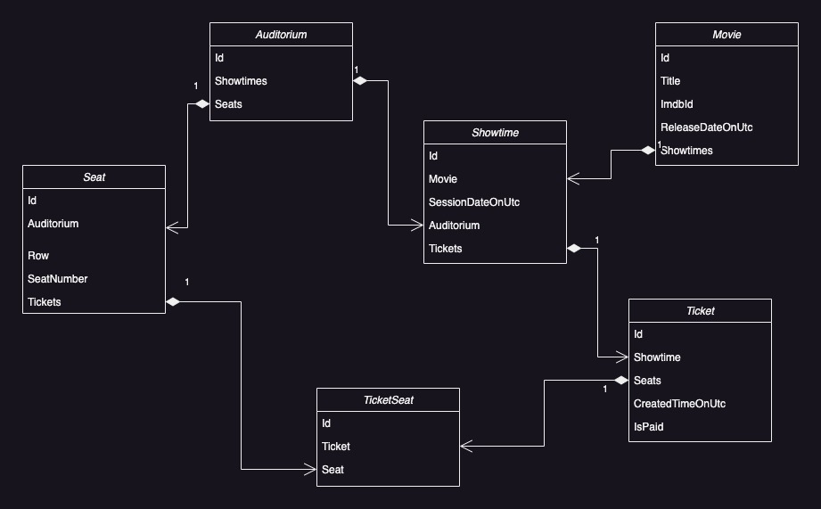
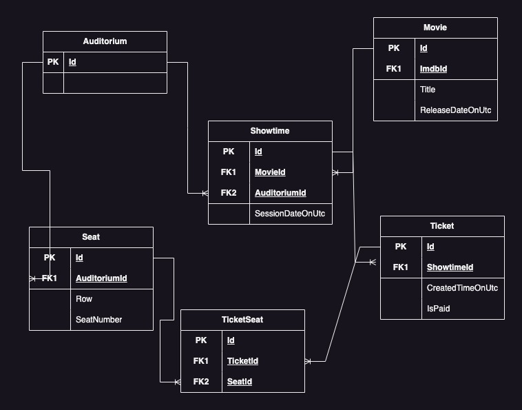

What is the Cinema Project?
=====================
The Cinema Project is a WebApi project written in .NET 7 following DDD and Clean Architecture.
The reservation bounded context manage the cinema showtimes and ticket reservation.

## How to use:

- You will need the latest Visual Studio 2022 and the latest .NET Core SDK (at least .NET 7 SDK).
- You will need also Docker Desktop running on your machine.
- To run the project just find and build the solution file JordiAragon.Cinema.Reservation.sln and select docker-compose as startup project.

## Architecture:

- Full architecture with responsibility separation concerns, SOLID and clean code (including zero warnings policy)
- Clean Architecture (Onion Architecture)
- Vertical Slices Architecture.
- Domain Driven-Design 
- Rich Domain Model with Aggregates and Strong Ids
- Domain/Application Events
- Outbox Pattern
- CQRS with MediatR and FluentValidation
- Unit of Work
- Repository & Specification
- Custom API Error Handling with Problems Details

## Custom Shared Kernel:
- This project uses [JordiAragon.SharedKernel](https://github.com/jordiaragonzaragoza/JordiAragon.SharedKernel) building blocks to follow DDD principles and Clean Architecture. 

## Diagram:

## Technologies implemented:

- ASP.NET 7.0
- Entity Framework Core 7.0
- FastEndpoints
- MediatR
- AutoMapper
- Autofac
- Ardalis.Result
- Ardalis.Specification
- Ardalis.SmartEnums
- Ardalis.GuardClauses
- FluentValidator
- Serilog
- Quartz
- Swagger UI with JWT support
- EasyCaching
- Volo.Abp.Guids
- StyleCop & SonarAnalyzer
- xUnit & NetArchTest & Testcontainers & Ardalis.HttpClientTestExtensions

## Cross-cutting concerns

- Outbox pattern to handle the domain event out side the source transaction.
- Result Pattern: Flow Control using Ardalis.Result avoiding throwing exceptions.
- API Versioning
- Application cache request with invalidation.
- Generic cache repository with invalidation.
- MediatR Pipelines (Decorator pattern)
 - LoggerBehaviour to track all requests.
 - UnitOfWorkBehaviour as a main exception handler to commit or rollback the transaction.
 - ValidationBehaviour to add custom validation per each query or command.
 - CachingBehavior and InvalidateCachingBehavior to apply/remove requests to the cache.
 - DomainEventsDispatcherBehaviour to dispatch domain events before complete the transation.
 - PerformanceBehaviour to track the execution time performance.

## Reservation Bounded Context - Commands and queries.

- Create showtime
    Create showtime for a given movie data.
    
- Reserve seats
    - Reserving the seat response will contain a GUID of the reservation, also the number of seats, the auditorium used and the movie that will be played.
    - It should not be possible to reserve the same seats two times.
    - It shouldn't be possible to reserve an already sold seat.
    - All the seats, when doing a reservation, need to be contiguous.
    - Reservation will expire in 1 minute unless marked as purchased.

- Purchase ticket reservation
    - We will need the GUID of the ticket reservation, it is only possible to do it while the seats are reserved.
    - It is not possible to purchase ticket reservation two times.

## Testing

- Architecture Tests to ensure DDD rules required in Vertical Slices Arquitecture
- Unit Tests: Domain and Application
- Functional Tests with Testcontainers: Presentation.WebApi
- Integration Tests with Testcontainers: Infrastructure.EntityFramework
- GitHub workflow CI with SonarCloud integration

## Model and Data Diagram:

  

  

## Resources and Inspiration

- <a href="https://github.com/ardalis/CleanArchitecture" target="_blank">Ardalis: Clean Architecture</a>
- <a href="https://www.youtube.com/watch?v=SUiWfhAhgQw" target="_blank">Jimmy Bogard: Vertical Slice Architecture</a>
- <a href="https://github.com/jasontaylordev/CleanArchitecture" target="_blank">Jason Taylor: Clean Architecture</a>
- <a href="https://www.oreilly.com/library/view/implementing-domain-driven-design/9780133039900/" target="_blank">Vaughn Vernon: Implementing Domain-Driven Design (book)</a>
- <a href="https://kalele.io/books/ddd-destilado/" target="_blank">Vaughn Vernon: Domain-Driven Design Destilado (book)</a>
- <a href="https://www.amazon.com/Hands-Domain-Driven-Design-NET-ebook/dp/B07C5WSR9B" target="_blank">Alexey Zimarev: Hands-on Domain-Driven Design (book)</a>
- <a href="https://github.com/dotnet-architecture/eShopOnContainers" target="_blank">Microsoft eShopOnContainers</a>
- <a href="https://github.com/dotnet-architecture/eShopOnWeb" target="_blank">Microsoft eShopOnWeb</a>
- <a href="https://github.com/kgrzybek/sample-dotnet-core-cqrs-api" target="_blank">Kamil Grzybek: Sample .NET Core REST API CQRS</a>
- <a href="https://github.com/kgrzybek/modular-monolith-with-ddd" target="_blank">Kamil Grzybek: Modular Monolith With DDD</a>
- <a href="https://github.com/oskardudycz/EventSourcing.NetCore" target="_blank">Oskar Dudycz: EventSourcing .NET</a>
- <a href="https://www.youtube.com/@CodeOpinion" target="_blank">CodeOpinion: Youtube Channel</a>
- <a href="https://www.youtube.com/@amantinband" target="_blank">Amichai Mantinband: Youtube Channel</a>
- <a href="https://www.youtube.com/@MilanJovanovicTech" target="_blank">Milan Jovanović: Youtube Channel</a>
- <a href="https://www.youtube.com/watch?v=26xrX113KZc" target="_blank">Explore DDD: Mauro Servienti - Talk Session: Welcome to the (State) Machine</a>

## About:

The Cinema Project was developed by <a href="https://www.linkedin.com/in/jordiaragonzaragoza/" target="_blank">Jordi Aragón Zaragoza</a>
