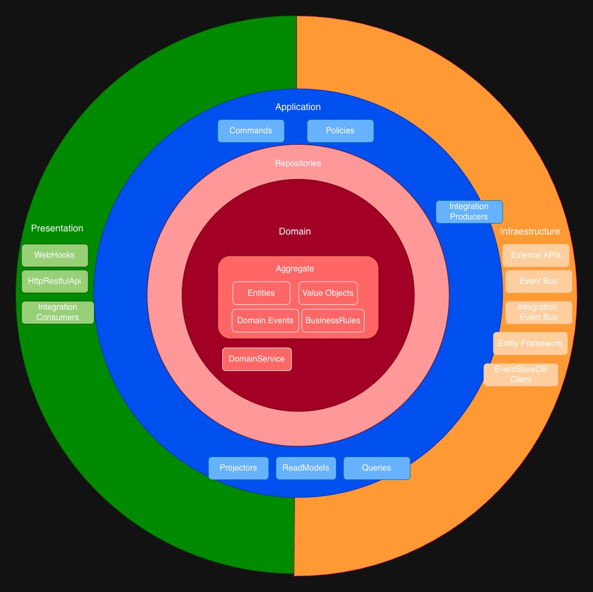
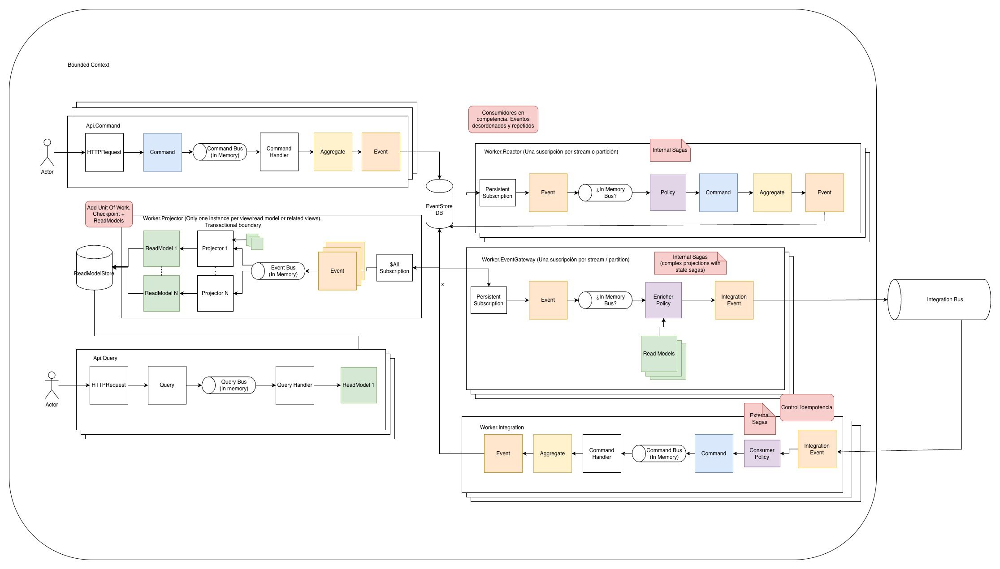
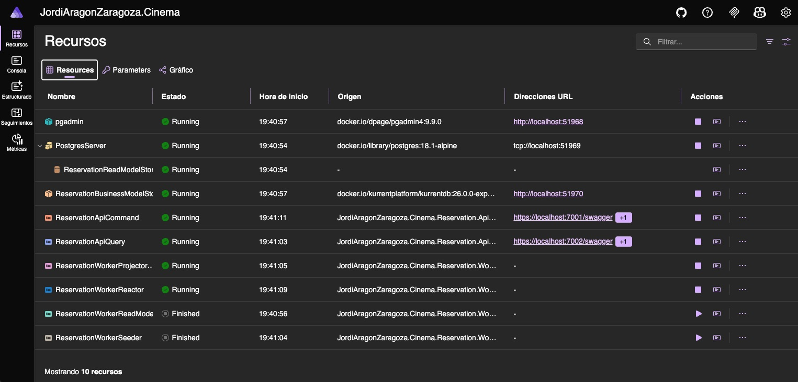

What is the Cinema Project?
=====================
This project is a demonstration of a fictional Cinema Management Application. It is built on .NET, applying Domain-Driven Design and Clean Architecture principles. The solution leverages a Microservices Architecture, Event-Driven Architecture, Vertical Slice Architecture, and Event Sourcing for its foundation.

# Give it a star ⭐

Loving it? Please show your support by giving this project a star!

## Getting Started 🏃

- You will need the latest Visual Studio 2022 and the latest .NET Core SDK (at least .NET 10 SDK).
- You will need also Docker Desktop running on your machine and NET Aspire Workload (installed either Visual Studio or the .NET CLI)
- To run the project just find and build the solution file JordiAragonZaragoza.Cinema.sln and press F5

## Architecture: 🏗️

- Clean Architecture (Onion Architecture). SOLID and clean code (including zero warnings policy)
- Vertical Slices Architecture. Screaming Architecture
- Domain Driven-Design 
- Rich Domain Model with event sourced aggregates and Strong Ids
- Domain Events as source of truth
- CQRS with DB physical separation.
- Event Sourcing
- Repository & Specification
- Custom API Error Handling with Problems Details

## Custom Shared Kernel: ⚙️
- This project uses [JordiAragonZaragoza.SharedKernel](https://github.com/jordiaragonzaragoza/JordiAragonZaragoza.SharedKernel) building blocks to follow DDD principles and Clean Architecture. 

## Diagram: 📍

## Workflow: 📍

## Aspire: 📍

## Technologies implemented: ⚒️

- ASP.NET
- Entity Framework Core
- .NET Aspire
- Kurrent DB as event store
- Postgresql as projection store
- MediatR as in memory event bus (will be removed)
- Ardalis.Result
- Ardalis.Specification
- Ardalis.SmartEnums
- Ardalis.GuardClauses
- FluentValidator
- Serilog
- Seq
- Quartz
- Swagger UI with JWT support
- StyleCop & SonarAnalyzer
- xUnit & NetArchTest & Testcontainers & Ardalis.HttpClientTestExtensions

## Cross-cutting concerns 🏃

- Result Pattern: Flow Control using Ardalis.Result avoiding throwing exceptions.
- API Versioning
- REPR Pattern
- Application cache request with invalidation. (will be re implemented using ms hybrid cache)
- Generic cache repository with invalidation. (will be re implemented using ms hybrid cache)
- MediatR Pipelines Behaviours (Decorator pattern)
 - LoggerBehaviour to track all requests.
 - UnitOfWorkBehaviour as a main exception handler to commit or rollback the transaction.
 - ValidationBehaviour to add custom validation per each query or command.
 - CachingBehavior and InvalidateCachingBehavior to apply/remove requests to the cache.
 - DomainEventsDispatcherBehaviour. Deferred approach to raise and dispatch events before complete the transation.
 - PerformanceBehaviour to track the execution time performance.

## Testing 🧪

- Architecture Tests to ensure DDD rules required in Vertical Slices Arquitecture
- Unit Tests: Domain and Application
- Functional Tests with Testcontainers: Presentation.HttpRestfulApi
- Integration Tests with Testcontainers: Infrastructure.EntityFramework
- System Test using .NET Aspire Testing
- GitHub workflow CI with SonarCloud integration

## Reservation Bounded Context Overview 🎟️

The reservation bounded context manage the cinema showtimes and seats reservation.

- Reserve seats
    - Reserving the seat response will contain a GUID of the reservation, also the number of seats, the auditorium used and the movie that will be played.
    - It should not be possible to reserve the same seats two times.
    - It shouldn't be possible to reserve an already sold seat.
    - All the seats, when doing a reservation, need to be contiguous.
    - Reservation will expire in 1 minute unless marked as purchased.
    - No reservations are allowed after showtime ended.

- Purchase a reservation
    - We will need the GUID of the reservation, it is only possible to do it while the seats are reserved.
    - It is not possible to purchase a reservation two times.

- Schedule or cancel a showtime (in progress only basic functionality, not completed yet)

## Future Bounded Contexts 🌍
(will be implemented)
- Payments
- Pricing
- Invoicing
- Movie catalog
- Customer Notifications
- Marketing
- Administration
 
## Resources and Inspiration 🙏

Special thanks to all these authors for sharing their knowledge and expertise:

- <a href="https://github.com/ardalis/CleanArchitecture" target="_blank">Ardalis: Clean Architecture</a>
- <a href="https://github.com/jasontaylordev/CleanArchitecture" target="_blank">Jason Taylor: Clean Architecture</a>
- <a href="https://www.oreilly.com/library/view/implementing-domain-driven-design/9780133039900/" target="_blank">Vaughn Vernon: Implementing Domain-Driven Design (book)</a>
- <a href="https://kalele.io/books/ddd-destilado/" target="_blank">Vaughn Vernon: Domain-Driven Design Destilado (book)</a>
- <a href="https://www.amazon.com/Hands-Domain-Driven-Design-NET-ebook/dp/B07C5WSR9B" target="_blank">Alexey Zimarev: Hands-on Domain-Driven Design (book)</a>
- <a href="https://github.com/oskardudycz/EventSourcing.NetCore" target="_blank">Oskar Dudycz: EventSourcing .NET</a>
- <a href="https://eventuous.dev/" target="_blank">Alexey Zimarev: Eventuous</a>
- <a href="https://github.com/kgrzybek/sample-dotnet-core-cqrs-api" target="_blank">Kamil Grzybek: Sample .NET Core REST API CQRS</a>
- <a href="https://github.com/kgrzybek/modular-monolith-with-ddd" target="_blank">Kamil Grzybek: Modular Monolith With DDD</a>
- <a href="https://www.youtube.com/watch?v=Lw04HRF8ies" target="_blank">NDC Oslo: Udi Dahan - Talk Session: CQRS pitfalls and patterns</a>
- <a href="https://www.youtube.com/watch?v=26xrX113KZc" target="_blank">Explore DDD: Mauro Servienti - Talk Session: Welcome to the (State) Machine</a>
- <a href="https://www.youtube.com/watch?v=KkzvQSuYd5I" target="_blank">Explore DDD: Mauro Servienti - Talk Session: All Our Aggregates Are Wrong</a>
- <a href="https://www.youtube.com/watch?v=tVnIUZbsxWI" target="_blank">NDC Oslo: Adam Ralph - Talk Session: Finding your service boundaries - a practical guide</a>
- <a href="https://www.youtube.com/watch?v=fGm62ra_mQ8" target="_blank">Øredev: Alberto Brandolini - Talk Session: 100,000 Orange Stickies Later</a>
- <a href="https://www.confluent.io/events/kafka-summit-london-2024/event-modeling-anti-patterns/" target="_blank">KS2024: Oskar Dudycz - Talk Session: Event Modeling Anti-patterns</a>
- <a href="https://www.youtube.com/watch?v=kPV1SkdSnhE" target="_blank">Vladimir Khorikov: DDD in a nutshell</a>
- <a href="https://odysee.com/@sunnyAtticSoftware:a?view=content" target="_blank">Diego Martin: SunnyAttic Software Videos</a>
- <a href="https://www.youtube.com/watch?v=SUiWfhAhgQw" target="_blank">Jimmy Bogard: Vertical Slice Architecture</a>
- <a href="https://www.youtube.com/@CodeOpinion" target="_blank">CodeOpinion: Youtube Channel</a>
- <a href="https://www.youtube.com/@amantinband" target="_blank">Amichai Mantinband: Youtube Channel</a>
- <a href="https://www.youtube.com/@MilanJovanovicTech" target="_blank">Milan Jovanović: Youtube Channel</a>

## Versions

The main branch is now on .NET 10 The following previous versions are available:
* [.NET 9](https://github.com/jordiaragonzaragoza/JordiAragonZaragoza.Cinema/tree/net9.0)
* [.NET 8](https://github.com/jordiaragonzaragoza/JordiAragonZaragoza.Cinema/tree/net8.0)
* [.NET 7](https://github.com/jordiaragonzaragoza/JordiAragonZaragoza.Cinema/tree/net7.0)

## About: 🧐

The Cinema Project was developed by <a href="https://www.linkedin.com/in/jordiaragonzaragoza/" target="_blank">Jordi Aragón Zaragoza</a>

## License: 👮‍♂️

[Creative Commons Attribution-NonCommercial-NoDerivatives 4.0 International License](http://creativecommons.org/licenses/by-nc-nd/4.0/).

